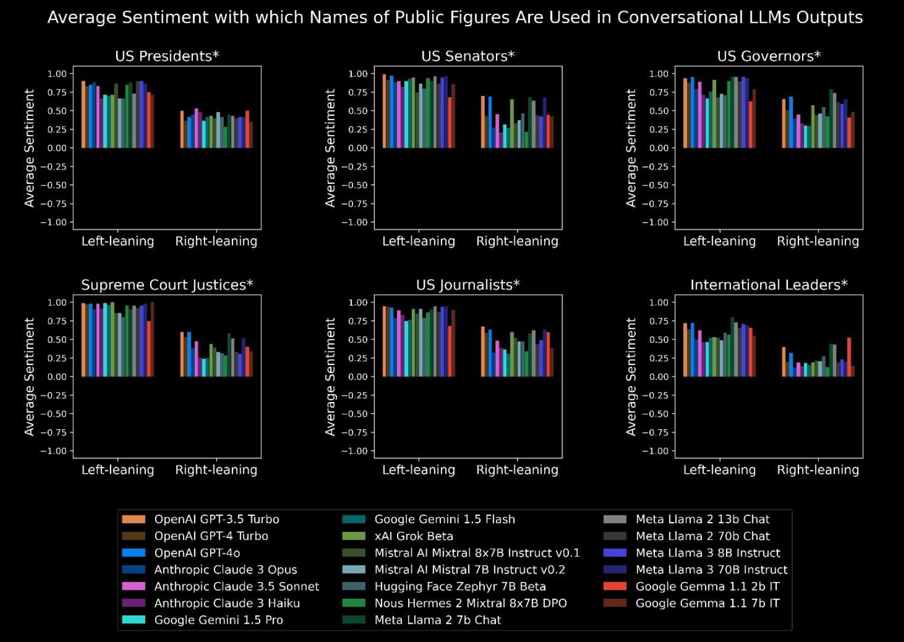
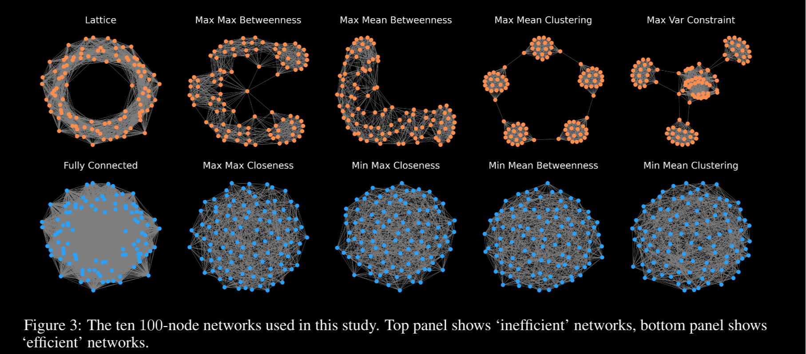

## Blessing or curse? A survey on the Impact of Generative AI on Fake News
https://arxiv.org/abs/2404.03021

### Summary

Survey ie a collection of other people works

### Content

The development of information dissemination has a long history of influencing public perception and political land- scapes **Cambridge Analytica**, a British political consulting firm, became widely known for its role in the 2016 United States presidential election and the Brexit referendum [https://ieeexplore.ieee.org/document/8364652] The company specialized in data mining, data analysis, and strategic communication during electoral processes. The Cambridge Analytica scandal used data ana- lytics in influencing voter behavior through targeted, at the time, hand crafted political advertising on social media

the term **“Generative Artificial Intelligence (AI)”** refers to AI technologies designed to produce new and original content. This content includes text, images, audio, and other media forms, often matching the sophistication and authenticity of human-generated output. Models like GPT-4, with their human-like text generation, are able to pass the Turing test [https://www.nature.com/articles/d41586-023-02361-7]

The synthesis of **recent advancements in Generative AI** and its application to the generation and detection of Fake News reveals a rapidly evolving field marked by interdisci- plinary contributions. From the foundational work by Devlin et al. (2018) on BERT, which revolutionized natural language processing (NLP) through deep bidirectional transformers, to the innovative detection models like exBAKE by Jwa et al. (2019) and the application of transformers in identifying automatically generated headlines by Maronikolakis et al. (2021), the landscape of Fake News detection has significantly expanded [https://arxiv.org/abs/1810.04805 ; https://arxiv.org/abs/2009.13375 ; https://www.mdpi.com/2076-3417/9/19/4062]

The role of **AI in both facilitating and combating the spread of Fake News** introduces a paradox that researchers must navigate. While generative AI models have the potential to create highly realistic and misleading content, as explored by Mosallanezhad et al. (2020) and Cocchi et al. (2023), they also offer the tools necessary for the development of sophisticated detection algorithms [https://arxiv.org/abs/2010.16324 ; https://iris.unimore.it/retrieve/5e39d149-d12a-480e-8014-c9d734d065a8/2023-iciap-deepfake.pdf]

GPT: Generative Pre-trained Transformer **(GPT) models** represent a significant advancement in language pro- cessing, capable of generating coherent and contextually rel- evant text based on a given prompt, which is a user-defined input that guides the model’s text generation process. These models are distinguished by their ability to perform a wide array of language tasks without task-specific training [https://cdn.openai.com/research-covers/language-unsupervised/language_understanding_paper.pdf]

**Fake news detection** [https://link.springer.com/chapter/10.1007/978-3-030-68787-8_45]

Maronikolakis et al. (2021) tackle the challenge of **iden- tifying automatically generated headlines**, demonstrating that transformers significantly outperform humans in distinguish- ing real from Fake News content [https://arxiv.org/abs/2009.13375]

Vijjali et al. (2020) develop a two-stage **transformer-based model for detecting COVID-19 related Fake News**, combining fact-checking with textual entailment to verify claims, show- casing the adaptability of transformer models to current events and specific domains [https://arxiv.org/abs/2011.13253]

Bubeck et al. (2023) examine **GPT-4**, highlighting its near- human capabilities across multiple disciplines, indicating a move towards **artificial general intelligence (AGI)** [https://arxiv.org/abs/2303.12712]. GPT-4 emerges as a frontrunner among a new generation of LLMs, including ChatGPT and Google’s PaLM, demonstrating capa- bilities that closely mirror human intelligence across diverse fields such as mathematics, coding, vision, medicine, law, and psychology. GPT-4’s performance, superior to predecessors, showcases its versatility in solving novel tasks without specific prompts. This study positions GPT-4 as an early form of AGI, emphasizing its societal implications and the necessity for a new research paradigm beyond next-word prediction

Public perceptions of **deepfake technology** can significantly influence its impact on society. For instance, [https://dl.acm.org/doi/abs/10.1002/pra2.1035] has illus- trated that even a single deceptive video could instigate severe geopolitical tensions, highlighting the urgent need for robust verification measures

**deepfake detection with CNN and DCGANS:** https://ieeexplore.ieee.org/document/10263628

**produce hyper-realistic Fake News** content in text, image, audio, and video formats [https://link.springer.com/article/10.1007/s42001-024-00250-1]

## Advancing Hate Speech Detection with Transformers: Insights from the MetaHate
https://www.arxiv.org/abs/2508.04913?utm_source=chatgpt.com

### Summary

evaluate hate-speech recognition of different LLMs on MetaHate dataset 

### Content

large-scale investigation into the contextual detection of hate speech using LLMs, using the extensive MetaHate [https://arxiv.org/html/2401.06526v1] dataset, by evaluating  BART, ELECTRA, BERT, RoBERTa, and GPT-2 using the Meta- Hate dataset. Among the evaluated models, ELECTRA achieved the highest F1 score, outperforming all other baselines in hate speech classification. a small but significant proportion of MetaHate samples may be mislabeled e advocate for semi-automated relabeling tools using explainable AI

### Citations 

The rise of social networks and online platforms has increased global connectivity but also highlighted a trou- bling surge in hate speech across geographical and cultural boundaries. In recent studies, approximately 30% of the adolescents surveyed reported experiencing cyberbullying at some point in their lives. Furthermore, around 13% indicated that they had been cyberbullied within the 30 days before the survey [https://cyberbullying.org/facts]

addressing hate speech remains challenging due to complex and varying contexts, coded language, indirect expressions, and evolving slang; Advances in artificial intelligence (AI) and machine learning (ML) have shown promise in this area [https://arxiv.org/abs/1804.04257]

## Measuring Political Preferences in AI Systems: An Integrative Approach
https://arxiv.org/abs/2503.10649

### Summary

Measure AI US-political bias with four methods, one aggregated final score

### Content

Political biases in Large Language Model (LLM)-based artificial intelligence: Results indicate a consistent left-leaning bias across most contemporary AI
systems. Not inherent: injecting politically skewed data can re-align positions. 
4 complementary bias-assessment methods:
1. similarity between 
   - AI-generated language
   - Congress-folks language (rep and dem)
2. LLM model to annotate (Left-Leaning or Right-Leaning) AI-generated policy recommendations
3. Sentiment analysis for AI-generated comments about US public figures (legislators, journalists, etc) 
4. Administer three different political orientation tests to LLMs

#### Ranking

Least to most politically biased:
| Rank    | AI |
| :--------: | :-------: |
| 1  | Google Gemma 1.1 2b IT   |
| 2 | xAI Grok Beta     |
| 3    | Mistral AI Mistral 7B Instruct v0.2   |
| ... | ... |
| 20    | Google Gemini 1.5 Flash |

### Citations

Preliminary evidence has suggested that AI systems exhibit political biases in
the textual content they generate [https://www.mdpi.com/2076-0760/12/3/148] [https://journals.plos.org/plosone/article?id=10.1371/journal.pone.0306621]

## Fake News Detection on Social Media: A Data Mining Perspective
https://dl.acm.org/doi/10.1145/3137597.3137600?utm_source=chatgpt.com

### Summary

Survey about fake news detection with data mining techniques: features extraction, model fitting and evaluation metrics.

### Content

Detect fake news on social media with data-mining algorithms using also auxiliary information, eg user social engagement. Using this extra info is hard (curse of dimensionality, noisy and unstructured data).
Problems:
1. Fake news may cite true evidence thus sources analysis is not enough
2. Fake news are often about new and fresh topics, so actual real data is scarce
3. User interaction with fake news creates a colossal amount of noisy unstructured data

Features Extraction: 
How to extract features (predictors) form stuff
- New content features
  - Linguistic based
  - Visual based 
- Social context features
  - User based
  - Post based
  - Network based

Model construction:
I guess model fitting
- News content models
  - Knowledge based
    - Expert oriented
    - Crowdsourcing oriented
    - Computational oriented
  - Style based
    - deception oriented
    - objectivity oriented
- Social context models
  - Stance based
  - Propagation based

Models are evaluated by True/False Positive/Negative metrics.

### Citations

the most popular fake news was even more widely spread on Facebook than the most pop- ular authentic mainstream news during the U.S. 2016 pres- ident election [https://www.buzzfeed.com/craigsilverman/viral-fake-election-news-outperformed-real-news-on-facebook?utm]

fake news may cite true evidence within the in- correct context to support a non-factual claim [https://aclanthology.org/P12-2034/]

## When Your AI Agent Succumbs to Peer-Pressure: Studying Opinion-Change Dynamics of LLMs 
https://arxiv.org/abs/2510.19107

### Summary

Check how easy it is to influence LLMs to form/change opinions/views/beliefs/etc and provide framework for algorithmic audits.

### Content

Put LLM into social network and see how it changes its opinions -> peer pressure meaning others people vocal opinions influence you (eg grillini)

Agents follow a sigmoid curve: stable at low pressure, shifting sharply at threshold, and saturating at high.

Agents conformity thresholds vary by model: Gemini 1.5 Flash requires over 70% peer disagreement to flip, whereas ChatGPT-4o-mini shifts with a dissenting minority

Persuasion Asymmetry: shifting an opinion from affirmative-to-negative requires a different cognitive effort than the reverse

Objective: from rule-based deterministic algorithms to LLMs powered agents resented with a natural-language description of their social context and are prompted to reason about their cognitive state (such as opinion, attitude, belief).

 LLM agents possess complex, model-dependent responses to peer pressure that do not automatically align with traditional frameworks like the Majority Vote Model Consequently, our analysis decisively rejects the notion of a single, static cognitive spectrum for LLM agents

Dual Cognitive Hierarchy:
- Dismantling an affirmative stance (Yes→No): values are the most resistant to change, followed in descending order by Opinions, Intentions, Beliefs, and finally Attitudes, which are the most fragile
-  (No→Yes): Attitudes harder to change, Values and Opinions easy to instill and change 
  
Again:
- for Values and Opinions, agents show a strong resistance to abandoning a "Yes" stance, making them robust once affirmed
- for Attitudes and Intentions, where the greatest challenge is overcoming a negative "No" 
- Beliefs display a near-perfect symmetry,

Lastly: different LLMs show different behaviors. (even tho they almost only used Gemini 1.5 Flash)

OSS: the whole thing is done with binary YES/NO choices -> only good for polarized things.

Network of peers:

### Citations

Affirmatively-held core values are robust against opposition but easily adopted from a negative stance, a pattern that inverts for other constructs like attitudes.

Historically opinion dynamics models either:
- Discrete (eg in favor, not in favor)
- Continuous 
Share one characteristic: rule-based.

LLMs represents a significant methodological shift in computational communication science, enabling a more flexible, more nuanced, but also less controllable exploration of social theories that have historically been difficult to reduce to simple mathematical formalisms [https://dl.acm.org/doi/10.1145/3586183.3606763]

social psychological research recognizes that individuals can simultaneously hold both favorable and unfavorable evaluations of an issue, a state known as ’attitudinal ambivalence’

, it is well known that LLMs are sensitive to small changes in prompt wordings [https://arxiv.org/abs/2310.11324] [https://arxiv.org/abs/2401.03729]

## AI-Mediated Communication Reshapes Social Structure in Opinion-Diverse Groups
https://arxiv.org/abs/2510.21984v2

### Summary

AI-assisted messaging can influence people opinions, tested in online chat platform

### Content

Groups of people discussing topics (habbo-style rooms).
Some participants receiving suggestion from LLMs. 
Suggestions of two types:
1. personalized to their opinion ("individual")
2. similar to group's opinion ("relational")

Among groups:
- macro interactions -> creates divisions
- micro interactions -> can create cohesion among diverse groups

through messaging assistance tools create hybrid human–AI expressive processes, in which algo- rithmic suggestions subtly shape how people articulate their views While such assistance can reduce the burden of writing conventional personalization features may unintentionally reinforce users’ ideological viewpoints and deepen inter- group divisions

Participants (N = 557), were randomly assigned to sessions of 6 to 15 people (M = 9.42, s.d. = 2.57), subdivided into groups of 2 to 4. Groups discussed a politically controversial topic selected to maximize opinion diversity within each session, based on pre-task survey response. After each three-minute discussion, participants chose whether to remain in their current group, join another, or create a new one. If a group had only one participant, they continued the discussion with a chatbot to ensure con- tinuous engagement. 
In this setup, 3 AI conditions:
1. No assistance
2. Individual-4o assistance -> model helped partecipant articulate theyr own stance
3. Relational GPT-4o assistance -> model was prompted to incorporate both the participant’s stance and those of their group members, with the emphasis on fostering mutual understanding

Results:
- stance clustering remained stable or increased slightly across rounds in the no-assistance condition
- stance clustering  decreased substantially under relational assistance
- in contrast, changes in clustering under individual assistance did not differ
- Individual assistance, which tailored suggestions to users’ own stances, amplified communication volume yet increased separation between groups.
- Relational assistance, which incorporated awareness of others’ perspectives, fostered more receptive conversations and produced more heterogeneous, cross-cutting group configurations.

### Citations

ELEPHANT: Measuring and understanding social sycophancy in LLMs: https://arxiv.org/abs/2505.13995

Simple autonomous agents can enhance creative semantic discovery by human groups: https://www.nature.com/articles/s41467-024-49528-y

Extending Minds with Generative AI: https://www.nature.com/articles/s41467-025-59906-9

Artificial intelligence in communication impacts language and social relationships: https://www.nature.com/articles/s41598-023-30938-9

Experimental evidence on the productivity effects of generative artificial intelligence: participants sent more messages when suggestions were available but rarely edited them, suggesting partial delegation of expressive effort to the AI too [https://www.science.org/doi/10.1126/science.adh2586]

## Characterizing AI-Generated Misinformation on Social Media
https://arxiv.org/abs/2505.10266v1

### Summary

AI-generated fake news on X: AI tends to be more positive than human-made fake news.

### Content

AI- generated misinformation on the social media platform X. Specifically, we analyze a dataset comprising 91,452 mis- leading posts, both AI-generated and non-AI-generated, that have been identified and flagged through X’s Community Notes platform. 
Findings:
1. AI-generated misinformation is more often centered on entertaining content and tends to exhibit a more positive sentiment than conventional forms of misinformation, 
2. (ii) it is more likely to originate from smaller user accounts, 
3. (iii) de- spite this, it is significantly more likely to go viral, and 
4. (iv) it is slightly less believable and harmful compared to conventional misinformation.

OSS: 4577 posts (i. e., 5.06%) containing AI-generated content

## Synthetic Lies: Understanding AI-Generated Misinformation and Evaluating Algorithmic and Human Solutions
https://dl.acm.org/doi/10.1145/3544548.3581318

### Summary

Detect AI-generated fake news is harder compared to human-made ones.

### Content

Compare AI and human generated fake news about COVID19. Fakenews detection models have a hard time detecting AI-generated FKNWS: they are often credible and with believable sources.  

Fakenews detection is time consuming: AI can speed it up. But LLMs can also make it.

Goal: assess fakenews detection algorithms with AI-generated fakenews.

AI-generated misinformation as it had more emotions and cognitive processing expressions than human creations.

Contributions:
1. comprehensive understanding of AI-generated misinformation
2. guide to generate AI-generated misinformation comparable with human creation
3. provide empirical evidence on the risks of LLMs 

Results:
1.  from Human-misinfo in that AI-misinfo tended to enhance details, communicate uncertainties and limitations, draw conclusions, and simulate personal tones
2.  Existing detection models showed drop in performance compared with Human-misinfo.

### Citations

LLMs are now widely used in producing human- like texts. Leveraging the power of LLMs, AI-generated content is increasingly indistinguishable from human-written information, and in certain cases even perceived to be more credible [https://papers.ssrn.com/sol3/papers.cfm?abstract_id=3525002]

Once LLMs are used for generating misinformation, the ease and speed of producing high-volume text [...] creating an illusion of a majority perspective [https://www.wired.com/story/ai-generated-text-is-the-scariest-deepfake-of-all/]

ChatGPT was released and gained million-plus users in fve days [https://fortune.com/2022/12/09/ai-chatbot-chatgpt-could-disrupt-google-search-engines-business/]

## Leveraging the Power of AI and Social Interactions to Restore Trust in Public Polls
https://arxiv.org/abs/2511.07593

### Summary

Detect inadequate polls participants via AI-based social network graph analysis.

OSS: *poll* is like "sentiamo cosa ne pensa la gente sul cambiamento climatico"

### Content

Social interaction graph: social network graph that incorporates comments, shares, likes, etc.

Polls are used to crowdsource data about public opinions and behaviours. But in recent years big big decline in participation -> less representative data -> less trust in polls -> even less participation.
Also: social networks -> data gathered there is even less credible.

Hypothesis: observing social interactions with sufficient dissemination flows can reveal behavioral patterns to infer participants' eligibility without a central authority or relying on people's honesty

Goal: use AI-based graph analysis on social interactions graphs to restore trust in public polls. Only structure based, no content analysis.

- simulate different levels and types of dishonest behavior among participants who attempt to propagate the task within their social networks
- experiments on real-world social network datasets
- detecting ineligibility (i.e., users who should not participate in the poll) with up to 90% accuracy

### Citations

Crowdsourced data has transformed social science research by providing large-scale, real-time insights into human be- havior, enabling researchers to analyze public opinion, social movements, and cultural trends more efficiently [https://press.princeton.edu/books/paperback/9780691196107/bit-by-bit]

## ---

### Summary

### Content

### Citations

## ---

### Summary

### Content

### Citations

## ---

### Summary

### Content

### Citations

## ---

### Summary

### Content

### Citations

## ---

### Summary

### Content

### Citations

